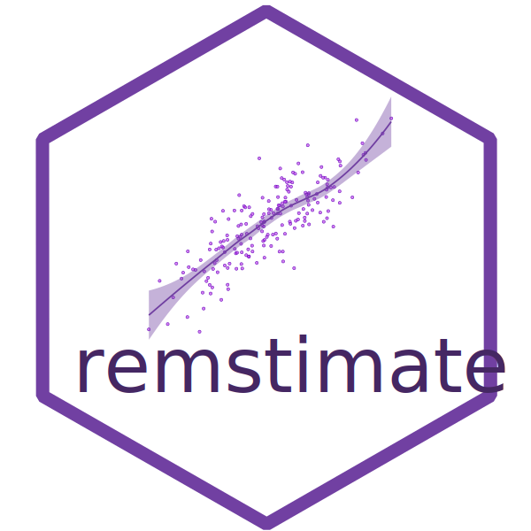

<br />



## **remstimate** 

### _Optimization Tools for Relational Event History data_

<!-- badges: start -->
[](https://www.repostatus.org/#active)
[](https://www.github.com/TilburgNetworkGroup/remstimate)
[](https://github.com/TilburgNetworkGroup/remstimate/actions/workflows/check-standard.yaml)
[](https://codecov.io/gh/TilburgNetworkGroup/remstimate)
[](https://cran.r-project.org/package=remstimate)
<!-- badges: end -->

<br />
The `remstimate` package provides a set of functions that perform necessary calculations when modeling a Relational Event History. It can perform tie-oriented as well as actor-oriented modeling. The main function is `remstimate::remstimate()` which provides four different estimation methods: 

- `"MLE"`, maximizing the model likelihood;
- `"GDADAMAX"`, optimization based on the gradient;
- `"BSIR"`, Bayesian Sampling Importance Resampling;
- `"HMC"`, Hamiltonian Monte Carlo.

<br />

### Installation

Install the package in R from CRAN:

```
install.packages("remstimate")
```
<br />

### Vignettes

List all the vignettes available with `remstimate` using:

```
vignette(package = "remstimate") 
```

Open the vignette of a specific topic with:

```
vignette(topic = "remstimate", package = "remstimate") # or simply vignette("remstimate") 
```
<br />

### Problems while remstimat-ing?

Should you encounter errors while using the package, should you have questions that are not answered in the Vignettes, or for reporting any kind of malfunction of the package, you can open an issue [here](https://github.com/TilburgNetworkGroup/remstimate/issues). 

When opening an issue, please, use a descriptive title that clearly states the issue, be as thorough as possible when describing the issue, provide code snippets that can reproduce the issue.
<br />

### Funding
The funder of this work is the ERC and the ERC project number is 758791.

